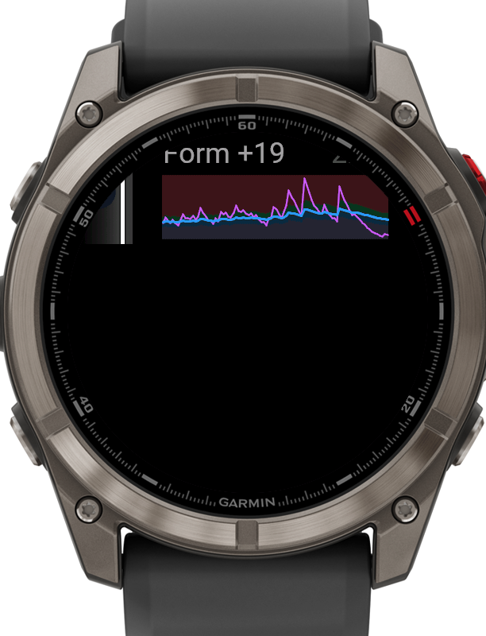
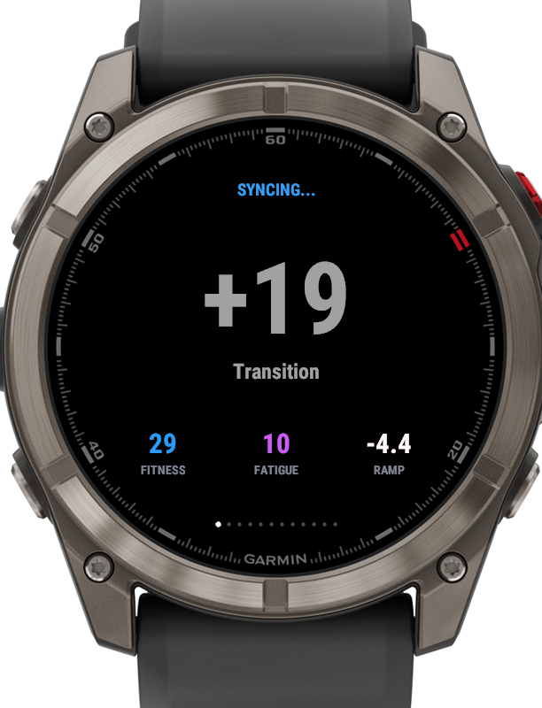
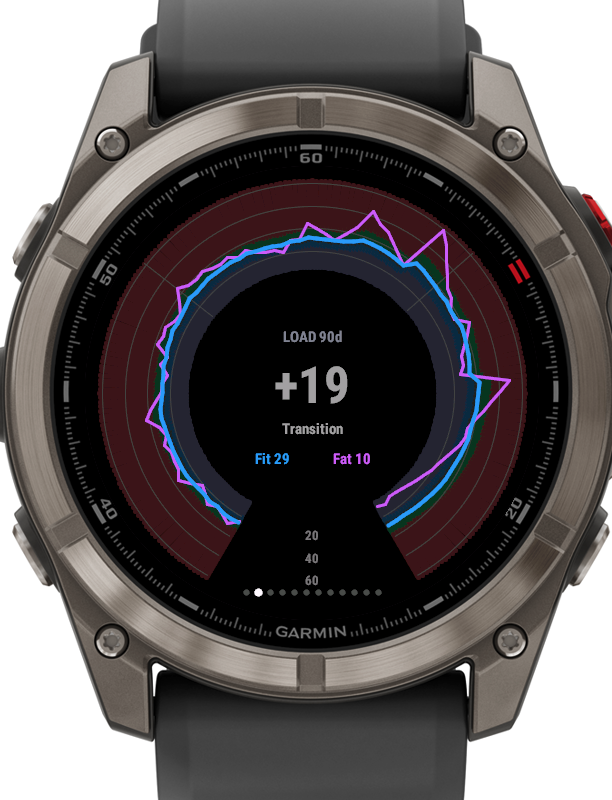
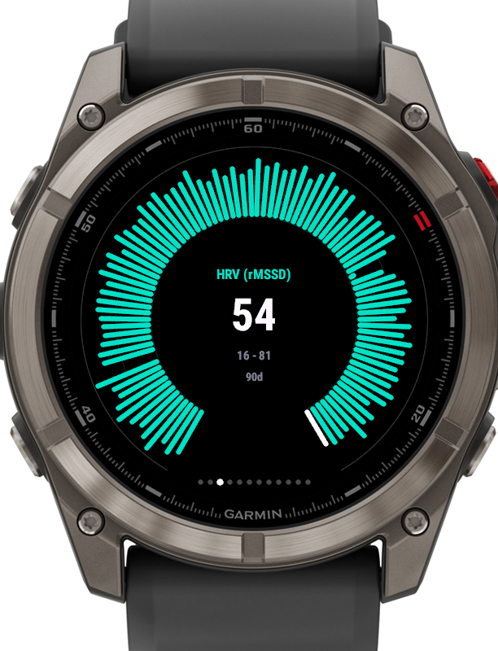
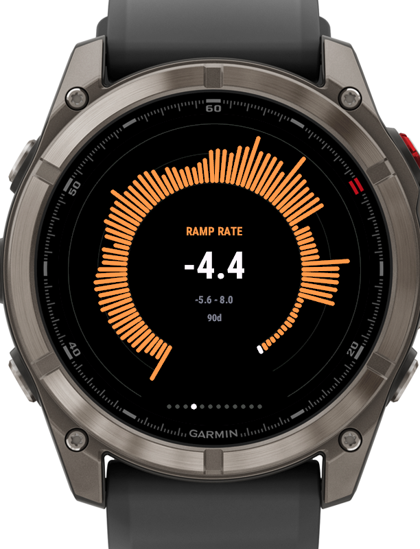
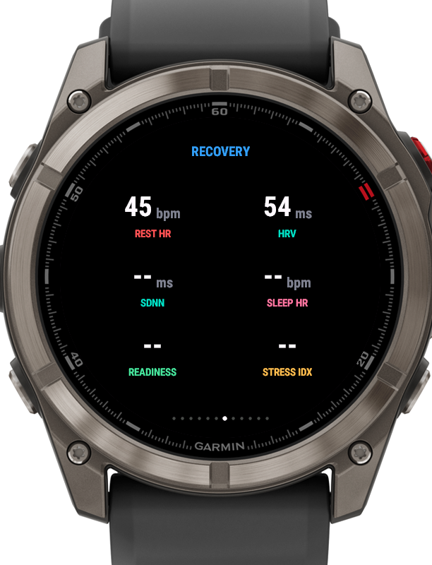

# Intervals — an intervals.icu widget for Garmin watches

A Connect IQ **widget with a glance** that brings your
[intervals.icu](https://intervals.icu) fitness data to round-screen Garmin
watches. Built for and tuned on the Fenix 8 Pro MicroLED (`fenix8pro47mm`,
454×454, API 6.0); supports 59 device IDs across the Fenix 7/8, Epix 2,
Forerunner, Venu, MARQ 2, Descent, Approach and Instinct 3 AMOLED families
(layouts scale with screen size; MIP models render the chart palette with
fewer colors).

| Glance | Form | Load (polar) |
|---|---|---|
|  |  |  |

| HRV ring | Ramp rate ring | Recovery tiles |
|---|---|---|
|  |  |  |

More: [eFTP](docs/screenshots/05-eftp-ring.png) ·
[steps](docs/screenshots/06-steps-ring.png) ·
[sleep](docs/screenshots/08-sleep.png) ·
[body](docs/screenshots/09-body.png) ·
[fuel](docs/screenshots/10-fuel.png)

## Features

- **Glance** — a compact banded CTL/ATL chart (the form-zone colors at a
  glance) with the current form value and data age, right in the widget
  carousel.
- **Form page** — big TSB value with zone label, plus Fitness / Fatigue /
  Ramp rate.
- **Polar load chart** — CTL and ATL wrapped around the bezel over the
  time-varying form-zone bands (transition / fresh / grey / optimal /
  high-risk), computed per angle step from interpolated CTL. The display
  range auto-fits the data and band envelope; labeled value arcs and 30-day
  spokes keep it readable. A rectangular variant is available via the
  **Round charts** toggle.
- **Up to four configurable metric charts** — three line/ring slots plus a
  dedicated ring slot, each choosing from 17 metrics: HRV (rMSSD/SDNN),
  resting/sleeping HR, ramp rate, eFTP, weight, body fat, VO2max, sleep
  score/hours, readiness, steps, SpO2, respiration, Baevsky stress index,
  calories. Radial bar rings (newest day highlighted) or auto-scaled line
  charts with gap handling for sparse data.
- **Stat tile pages** — recovery, sleep, body, fuel and subjective wellness
  rendered as a modern tile grid with vector fonts auto-fitted to their
  space (no clipped or colliding text on the round display).
- **Status page** — last sync, athlete, API key state, errors.
- **Sync** — a background service polls hourly; opening the widget refreshes
  data older than 15 minutes; START forces a sync. The trend window is
  fetched in 30-day chunks to stay inside the watch's HTTP response limit.

## Requirements

- A free [intervals.icu](https://intervals.icu) account and its API key
  (intervals.icu → Settings → Developer Settings).
- Garmin Connect IQ SDK ≥ 6 (built with 9.2) and a Java runtime
  (`brew install --cask connectiq` and `brew install openjdk` on macOS).
- Device files for `fenix8pro47mm`, downloaded once via the Connect IQ SDK
  Manager (`brew install --cask connectiq-sdk-manager`, requires a free
  Garmin developer login).

## Build

```sh
./build.sh                  # debug build -> bin/intervals-widget.prg
./build.sh --release
DEVICE=fr955 ./build.sh     # debug build for another supported device
./build.sh --export         # beta store package (beta app ID)
./build.sh --export-prod    # production store package (its own app ID,
                            # since each store listing needs a unique one)
```

The script locates the SDK (Homebrew cask or SDK Manager install), generates
a signing key on first run, and — if a git-ignored `.apikey` file exists in
the repo root — bakes its contents in as the default `apiKey` property so a
sideloaded build needs no further configuration:

```sh
echo -n "your-intervals-api-key" > .apikey   # optional, never committed
```

Without `.apikey` the key must be set in the app settings (Connect IQ phone
app for store installs, or the simulator's settings editor).

## Install on the watch

Connect the watch via USB (MTP — use Android File Transfer or OpenMTP on
macOS) and copy `bin/intervals-widget.prg` into `/GARMIN/Apps/`. Restart the
watch; the glance appears in the carousel.

## Settings

| Setting | Default | Notes |
|---|---|---|
| intervals.icu API key | – | from intervals.icu Developer Settings |
| Athlete ID | `0` | `0` = the key's owner; coaches can use `i12345` IDs |
| Glance display | fit+fat+form | or fitness / fatigue / form only |
| Show form as % of fitness | off | matches the intervals.icu zone scale |
| Round charts | on | polar load chart + ring metric charts |
| Chart window | 3 months | 6 weeks / 3 months / 6 months |
| Chart 1–3 | HRV, ramp rate, eFTP | line/ring chart slots |
| Ring chart | steps | dedicated radial bar chart |
| Show … page | all on | hide form / recovery / sleep / body / fuel / feel / status |

## Simulator

```sh
SDK=~/Library/Application\ Support/Garmin/ConnectIQ/Sdks/connectiq-sdk-mac-*
$SDK/bin/connectiq                                  # start simulator
$SDK/bin/monkeydo bin/intervals-widget.prg fenix8pro47mm
```

Set the API key via File → Edit Persistent Storage → Edit Application.Properties,
and trigger a background sync with Simulation → Background Events → Temporal
Event. Note the simulator preserves app settings across reinstalls — delete
`GARMIN/APPS/SETTINGS/INTERVALS-WIDGET.SET` from the simulator's temp
filesystem if changed property defaults don't seem to apply.

## How it talks to intervals.icu

Authentication is HTTP Basic with the literal username `API_KEY` and your
personal key as the password. Two request flavors hit
`GET /api/v1/athlete/{id}/wellness` with a `fields=` filter (which also
strips nulls, keeping payloads small for the watch):

1. the last 7 days of every displayed wellness metric, collapsed to the most
   recent non-null value per field;
2. the chart window of `ctl,atl` plus the selected chart metrics, fetched in
   ≤30-day chunks (a 90-day response with `sportInfo` exceeds the watch's
   response buffer).

Form (TSB) is computed as `ctl − atl`; the zone bands follow intervals.icu's
form-as-%-of-fitness thresholds (+20 / +5 / −10 / −30). eFTP comes from the
wellness `sportInfo` array (first sport entry).

Please be polite to the API — the widget syncs hourly in the background and
on-demand, which is well within what the intervals.icu folks ask of clients.

## License

[MIT](LICENSE)
